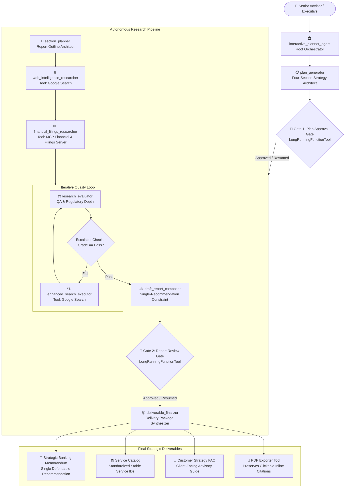

# 🏛️ Deep Search Agent — Gemini Advisors Banking Strategy Platform

[](https://adk.dev/)
[](https://cloud.google.com/vertex-ai)
[](https://python.org)
[](https://fastapi.tiangolo.com)
[](https://vitejs.dev/)

An institutional-grade, multi-agent strategic advisory and deep research platform built on the **Google Agent Development Kit (ADK)** and powered by **Gemini 3.7 Flash**.

Gemini Advisors specializes in cross-border investment banking strategy, financial filings analysis, capital adequacy modeling, and regulatory intelligence across the **United States** (SEC, Fed, OCC, CFTC, FINRA), **European Union** (ECB, ESMA, MiFID II, DORA, CRD/CRR), and **China** (PBOC, NFRA, CSRC, SAFE).

---

## 🏗️ Architecture & Orchestration Flow



---

## 🌟 Key Capabilities & Highlights

1. **Grounded Search & MCP Tool Specialization**:
   - **`web_intelligence_researcher`**: Uses Google Search solely for recent regulatory changes, announcements, and policy updates.
   - **`financial_filings_researcher`**: Connects to the **MCP Financial & Filings Server** for structured balance sheet metrics, 10-K/10-Q filings, CET1 ratios, and M&A comparables.
2. **Dual Structural Human-in-the-Loop (HITL) Gates**:
   - **Gate 1 (`request_plan_approval`)**: Suspends invocation and checkpoints state until the four-section plan (Objectives, Methods, Evaluation Criteria, Expected Outcomes) is reviewed and approved.
   - **Gate 2 (`request_report_approval`)**: Checkpoints the drafted report for reviewer sign-off on the single chosen recommendation before final deliverables are compiled.
3. **Strict Single-Recommendation Rule**:
   - The strategy engine decisively commits to **one optimal recommendation** backed by regulatory rigor, rather than an uncommitted menu of options.
4. **Institutional Deliverables**:
   - **Strategic Banking Memorandum** with inline `<cite source="src-N"/>` citations.
   - **Standardized Service Catalog** (`[SVC-US-SEC-01]`, `[SVC-EU-DORA-02]`, `[SVC-CN-NFRA-03]`).
   - **Customer Strategy FAQ** for advisory teams.
   - **Automated PDF Export** with intact clickable links.
5. **Modern Interactive UI**:
   - Standalone React 19 + Tailwind CSS + Lucide icons dashboard with live plan visualization, step-by-step progress tracking, deliverable previews, and citation viewer.

---

## 📁 Repository Structure

```
.
├── gemini-advisors-research/           # Core agent project
│   ├── app/                            # Agent definitions & implementation
│   │   ├── agent.py                    # Multi-agent graph & ADK orchestration
│   │   ├── config.py                   # Configuration and settings
│   │   ├── fast_api_app.py             # Unified FastAPI / A2A server
│   │   ├── mcp_server.py               # Custom Financial & Filings MCP Server
│   │   └── pdf_exporter.py             # Formatted PDF export generator
│   ├── frontend/                       # Interactive React frontend
│   │   ├── src/                        # UI components, state, hooks
│   │   ├── package.json                # Frontend dependencies
│   │   └── vite.config.ts              # Vite bundler configuration
│   ├── tests/                          # Tests & Quality Flywheel suite
│   │   ├── unit/                       # Unit tests
│   │   ├── integration/                # Integration tests
│   │   ├── load_test/                  # Locust load test suite
│   │   └── eval/                       # ADK evaluation datasets & metrics
│   │       ├── eval_config.yaml        # Metric configurations (single_recommendation, etc.)
│   │       ├── response_quality.py     # Local LLM judge evaluator
│   │       └── datasets/               # Evaluation datasets
│   ├── deployment/                     # Terraform & deployment manifests
│   │   └── terraform/                  # Vertex AI Agent Runtime / Cloud Run infra
│   ├── .env.example                    # Environment variable template
│   ├── pyproject.toml                  # Python package & dependency configuration
│   ├── Dockerfile                      # Production container image build
│   └── Makefile                        # Development automation commands
├── .agents/skills/                     # ADK CLI workflow & development skills
├── skills-lock.json                    # Locked skills manifest
├── .gitignore                          # Git ignore rules
└── README.md                           # Project documentation
```

---

## 🚀 Getting Started

### Prerequisites

- **Python 3.12+**
- **uv** package manager:
  ```bash
  curl -LsSf https://astral.sh/uv/install.sh | sh
  ```
- **Node.js 18+** & **npm**
- **google-agents-cli**:
  ```bash
  uv tool install google-agents-cli
  ```
- A **Google Cloud Project** with Vertex AI enabled, or a **Google AI Studio API Key**.

---

### Step 1: Clone the Repository

```bash
git clone git@github.com:YOUR_USERNAME/deep-search-agent.git
cd deep-search-agent/gemini-advisors-research
```

---

### Step 2: Configure Environment Variables

Copy `.env.example` to `.env` and set your credentials:

```bash
cp .env.example .env
```

Edit `.env`:

```bash
# Vertex AI Configuration (Recommended)
GOOGLE_GENAI_USE_VERTEXAI=true
GOOGLE_CLOUD_PROJECT=your-gcp-project-id
GOOGLE_CLOUD_LOCATION=global
MODEL_NAME=gemini-3.7-flash

# Alternatively, for Google AI Studio API:
# GEMINI_API_KEY=your-api-key-here
# MODEL_NAME=gemini-3.7-flash
```

Authenticate with Google Cloud (if using Vertex AI):
```bash
gcloud auth application-default login
gcloud config set project YOUR_GCP_PROJECT_ID
```

---

### Step 3: Install Dependencies

```bash
# Install Python virtual environment and dependencies
uv sync

# Install Frontend dependencies
cd frontend && npm install && cd ..
```
*Or simply run:*
```bash
make install
```

---

### Step 4: Run Locally

#### Option A: Agent Playground (Fastest)
Launches the built-in development UI with live-reloading:
```bash
agents-cli playground
```
Open your browser at: `http://127.0.0.1:8080/dev-ui/?app=app`

#### Option B: Full Application (Backend + React Frontend)
Run both backend and frontend concurrently:
```bash
make dev
```
- **Backend API:** `http://127.0.0.1:8000`
- **Frontend Dashboard:** `http://localhost:5173`

---

## 🧪 Testing & Evaluation

### Run Unit Tests
```bash
uv run pytest
```

### Run ADK Behavioral Evaluation (Quality Flywheel)
```bash
agents-cli eval run
```
Evaluates the agent against test datasets across:
1. `custom_response_quality` (Accuracy, depth, clarity via LLM judge)
2. `tool_use_quality` (Correct tool selection & parameter precision)
3. `safety` (Harmful content, PII, policy compliance)
4. `single_recommendation` (Enforces one best recommendation, flags menu-of-options language)

Results and HTML reports are generated in `artifacts/grade_results/`.

---

## ☁️ Deployment

### Deploy to Vertex AI Agent Runtime
```bash
agents-cli deploy --project YOUR_PROJECT_ID --region us-central1
```

### Dry Run Deployment
```bash
agents-cli deploy --dry-run --project YOUR_PROJECT_ID
```

For custom infrastructure, secret management, or CI/CD pipelines with GitHub Actions, refer to [deployment/terraform/](gemini-advisors-research/deployment/terraform).

---

## 📄 License

This project is licensed under the Apache 2.0 License.
