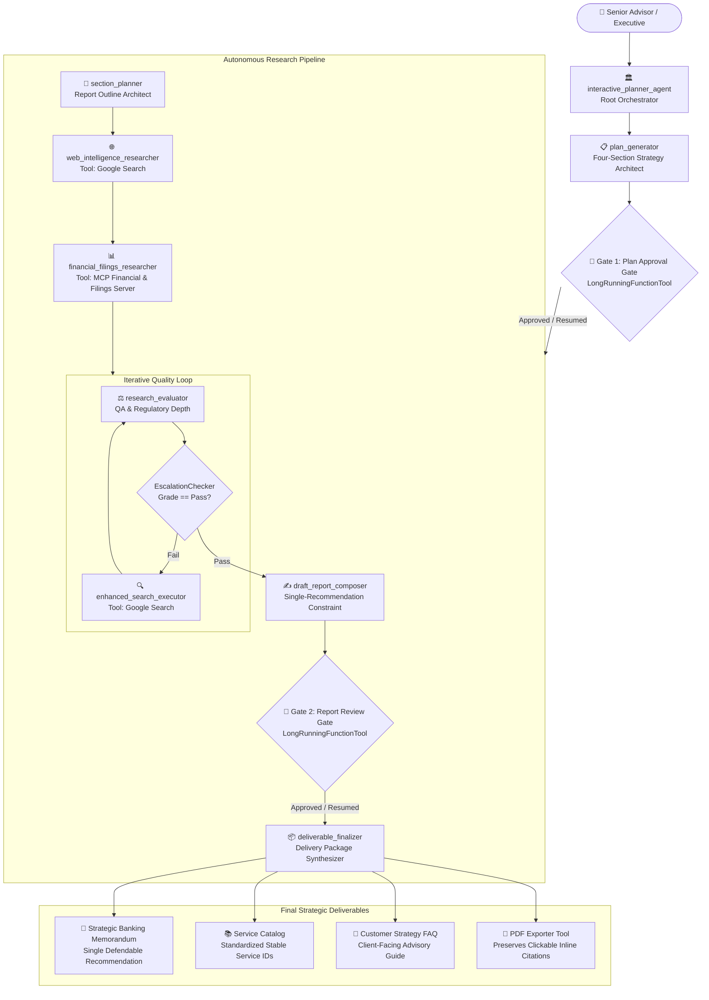

# 🏛️ Gemini Advisors — Banking Strategy Research Agent

An institutional-grade, multi-agent AI research and strategic advisory platform built on the **Google Agent Development Kit (ADK)** and powered by **Gemini 3.7 Flash**.

Gemini Advisors specializes in cross-border investment banking strategy, financial filings analysis, capital adequacy modeling, and regulatory intelligence across the **United States** (SEC, Fed, OCC, CFTC, FINRA), **European Union** (ECB, ESMA, MiFID II, DORA, CRD/CRR), and **China** (PBOC, NFRA, CSRC, SAFE).

---

## 🏗️ Architecture & Orchestration Flow



---

## 🌟 Key Capabilities & Design Principles

1. **Separated Grounded Search & Non-Search Toolsets:**
   - **`web_intelligence_researcher`**: Dedicated solely to `google_search` for policy updates, speeches, and regulatory releases.
   - **`financial_filings_researcher`**: Dedicated to the custom **Financial & Filings MCP Server** (`get_company_filing`, `get_market_data`, `get_regulatory_capital_metrics`, `get_cross_border_mna_comparables`).
2. **Dual Structural Human-in-the-Loop (HITL) Gates:**
   - **Gate 1 (`request_plan_approval`)**: Suspends invocation and checkpoints state until the four-section plan (Objectives, Methods, Evaluation Criteria, Expected Outcomes) is reviewed and approved.
   - **Gate 2 (`request_report_approval`)**: Checkpoints the drafted report for reviewer sign-off on the single chosen recommendation before final deliverables are compiled.
3. **Strict Single-Recommendation Constraint:**
   - The composer decisively commits to **one optimal strategic action** and is strictly prohibited from returning open-ended menus of alternatives.
4. **Structured Institutional Deliverables:**
   - **Strategic Banking Memorandum** with inline `<cite source="src-N"/>` citations.
   - **Standardized Service Catalog** establishing permanent IDs (`[SVC-US-SEC-01]`, `[SVC-EU-DORA-02]`, `[SVC-CN-NFRA-03]`).
   - **Customer Strategy FAQ** derived directly from the Service Catalog.
   - **Automated PDF Export Tool** rendering formatted documents while preserving all clickable inline citation links.

---

## 🚀 Quick Start

### 1. Install Dependencies
```bash
make install
# or
uv sync && npm --prefix frontend install
```

### 2. Configure Environment
Set your Google Cloud credentials or API key in `.env`:
```bash
MODEL_NAME=gemini-3.7-flash
GOOGLE_GENAI_USE_VERTEXAI=true
GOOGLE_CLOUD_PROJECT=your-gcp-project-id
GOOGLE_CLOUD_LOCATION=us-central1
```

### 3. Launch Development Playground
```bash
agents-cli playground
```
Access the interactive web UI at `http://127.0.0.1:8080` (or `make dev` for Vite React frontend).

---

## 📊 Deployment & Observability

- **Deployment Target:** Vertex AI Agent Runtime (`us-central1`).
- **Session State:** Managed automatically by Agent Platform Sessions with state checkpointing for HITL long-running tool suspensions.
- **Analytics:** Interactions streamed to BigQuery Agent Analytics dataset.
- **CI/CD:** Automated GitHub Actions workflows in `.github/workflows/`.
